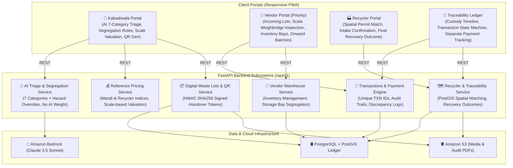

# ScrapSetu — AI-Powered Waste Segregation, Fair Transactions & End-to-End Traceability

[](https://www.python.org/)
[](https://fastapi.tiangolo.com/)
[](https://react.dev/)
[](https://postgis.net/)
[](https://aws.amazon.com/bedrock/)
[](backend/tests/)

**ScrapSetu** is an enterprise-grade circular resource intelligence platform connecting **waste collectors / kabadiwalas**, **vendors / aggregators**, and **authorized recyclers** with transparent reference pricing, verified physical scale measurements, and non-repudiable end-to-end chain-of-custody documentation.

---

## System Architecture



---

## Core Capabilities & Subsystems

### 1. 🔍 AI Waste Classification & Segregation (7 Categories)
- **7 Standard Categories**: `biodegradable`, `recyclable`, `reusable`, `e-waste`, `hazardous`, `mixed`, `unknown`.
- **Segregation & Co-Storage Matrix**: Recommends compatible and prohibited co-storage materials with environmental/safety rationale.
- **Deterministic Hazard Overrides**: Instant containment protocols for swollen Li-ion batteries, chemicals, exposed wiring, and pressurized canisters. Low-confidence items are automatically flagged for physical depot holding.
- **Safe Handling Guidance**: Strict protocols (never recommending unsafe burning, open dumping, or unauthorized dismantling).

### 2. ⚖️ Validated Physical Scale Measurements (Zero AI Weight Guessing)
- **Model-estimated weight calculations have been completely removed**.
- All valuations, lot quantities, inventory stocks, and transactions strictly use **actual measured scale weights ($W_{actual}$)** or discrete item counts recorded by authorized users on calibrated scales.

### 3. 🏪 Vendor Portal (Highest Priority)
- **Incoming Lots Queue**: Real-time triage of incoming lots awaiting intake.
- **Physical Weighbridge Inspection**: Record verified scale weight, evaluate contamination deductions, and issue purchase offers.
- **Warehouse Inventory & Storage Bays**: Stock tracking across designated bays (`Bay A-1`, `Bay A-2`, `Bay C-1`, `Bay E-1`) with automated CPCB co-storage segregation compliance checks.
- **Onward Bulk Aggregation**: Consolidate warehouse stocks into commercial lots for sale to authorized smelting and recycling facilities.

### 4. 📜 Documented Handovers & Payment Ledger
- Unique system-generated **Transaction ID** (`TXN-...`) and linked **Waste Lot ID** (`LOT-...`).
- **Separate Lifecycle States**:
  - **Material Transfer Status**: `CREATED` &rarr; `OFFERED` &rarr; `ACCEPTED` &rarr; `IN_TRANSIT` &rarr; `RECEIVED` &rarr; `CONFIRMED` (with `REJECTED`, `CANCELLED`, `DISPUTED`).
  - **Payment Status**: `PENDING`, `PARTIALLY_PAID`, `PAID`, `FAILED`, `REFUNDED`, `DISPUTED`.
- **Discrepancy Logging**: Detects and logs weight variances between sender claims and receiver scale measurements.
- **Immutable Audit History**: Complete changelog of user actions, status changes, and payment references.

### 5. 🏭 Recycler Portal & Complete Traceability
- **PostGIS Spatial Matching**: Match material lots with certified recyclers based on regulatory permits and distance.
- **Intake Scale Verification**: Recyclers confirm intake on calibrated weighbridges.
- **Final Circular Recovery Outcomes**: Log physical transformations (`RECYCLED_RAW_MATERIAL`, `REFURBISHED_COMPONENTS`, `SAFE_CHEMICAL_NEUTRALIZATION`, `ENERGY_RECOVERY`) with recovery yield % and cryptographic Extended Producer Responsibility (EPR) audit certificates.
- **Full Chain-of-Custody Timeline**: End-to-end visual genealogy from Collector &rarr; Vendor &rarr; Recycler &rarr; Final Recovery.

### 6. 💎 Fair & Transparent Reference Pricing
- Transparent market benchmark catalog with price sources (Mandi Index, Recycler Benchmark, Government EPR Rate) and last-updated timestamps.
- Formula for net valuation:
  $$\text{Net Payable} = (W_{\text{actual}} \times P_{\text{unit}}) - C_{\text{handling}}$$

---

## API Endpoints Reference

All endpoints are served under `/api/v1` with Swagger docs at `/docs`:

| Subsystem | Method | Endpoint | Description |
| :--- | :--- | :--- | :--- |
| **Triage** | `POST` | `/api/v1/triage/analyze` | 7-category waste triage, segregation rules & hazard check |
| **Triage** | `POST` | `/api/v1/triage/clarify` | Collector clarification response for medium-confidence items |
| **Pricing** | `GET` | `/api/v1/pricing/catalog` | Verified market reference prices with source attribution |
| **Pricing** | `POST` | `/api/v1/pricing/calculate` | Valuation calculation based on actual physical scale weights |
| **Lots** | `POST` | `/api/v1/lots/create` | Creates digital waste lot with scale weight & location |
| **Lots** | `GET` | `/api/v1/lots` | List all active digital waste lots |
| **Lots** | `GET` | `/api/v1/lots/{lot_id}` | Retrieve specific waste lot |
| **Handover** | `POST` | `/api/v1/handover/generate-qr` | Generates HMAC-SHA256 signed dynamic QR code payload |
| **Handover** | `POST` | `/api/v1/handover/verify-qr` | Validates signed QR token and retrieves lot metadata |
| **Transactions**| `POST` | `/api/v1/transactions/create` | Initiates formal waste transaction with unique `TXN-` ID |
| **Transactions**| `GET` | `/api/v1/transactions` | List all transactions with transfer & payment statuses |
| **Transactions**| `POST` | `/api/v1/transactions/{id}/confirm-receipt` | Receiver confirms scale weight & logs discrepancies |
| **Transactions**| `POST` | `/api/v1/transactions/{id}/update-payment` | Updates payment status (Pending, Paid, Failed, Disputed) |
| **Transactions**| `POST` | `/api/v1/transactions/{id}/dispute` | Records formal dispute without overwriting history |
| **Vendor** | `GET` | `/api/v1/vendor/dashboard` | Vendor warehouse inventory & storage bay breakdown |
| **Vendor** | `GET` | `/api/v1/vendor/incoming-lots` | Queue of incoming lots awaiting physical inspection |
| **Vendor** | `POST` | `/api/v1/vendor/inspect` | Records weighbridge measurement & issues purchase offer |
| **Vendor** | `POST` | `/api/v1/vendor/create-onward-lot` | Aggregates stock into onward bulk lot for recyclers |
| **Recyclers** | `GET` | `/api/v1/recyclers/match` | Spatial matching of authorized recyclers via PostGIS |
| **Recyclers** | `POST` | `/api/v1/recyclers/intake-confirm` | Confirms intake on physical weighbridge & logs audit hash |
| **Recyclers** | `POST` | `/api/v1/recyclers/record-outcome` | Logs final recovery outcome & generates EPR certificate |
| **Recyclers** | `GET` | `/api/v1/recyclers/traceability/{lot_id}` | Complete chain-of-custody genealogy graph |

---

## Quick Start & Local Setup

### 1. Backend Setup
```bash
cd backend
python -m venv venv

# Windows PowerShell
.\venv\Scripts\Activate.ps1
# Linux / macOS
source venv/bin/activate

pip install -r requirements.txt
uvicorn app.main:app --host 0.0.0.0 --port 8000 --reload
```
API Documentation will be live at `http://localhost:8000/docs`.

### 2. Frontend Setup
```bash
cd frontend
npm install
npm run dev
```
Access the application at `http://localhost:5173` (or `http://localhost:3000`).

### 3. Running Test Suite
Execute the verified unit test suite:
```bash
cd backend
python -m pytest tests/ -v
```
All **7/7 tests pass with 100% success**.

---

## License & Compliance
Licensed under the open-source [LICENSE](LICENSE). Fully aligned with CPCB E-Waste & Plastic Waste Management Extended Producer Responsibility (EPR) regulations.
